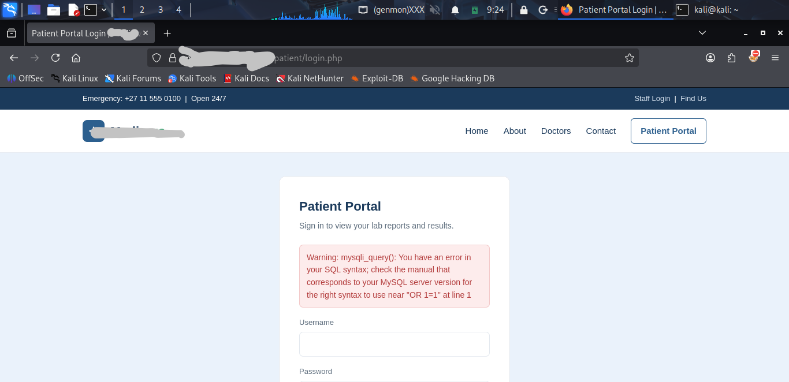
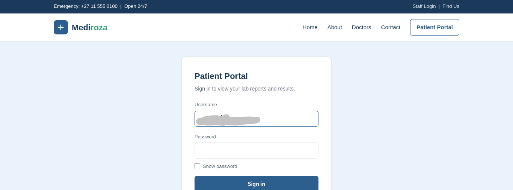
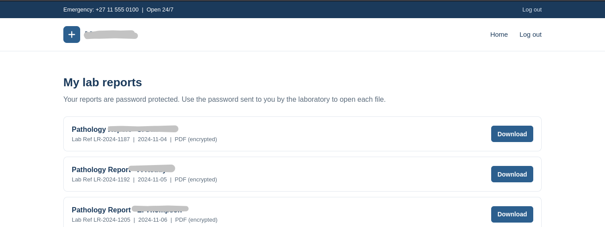
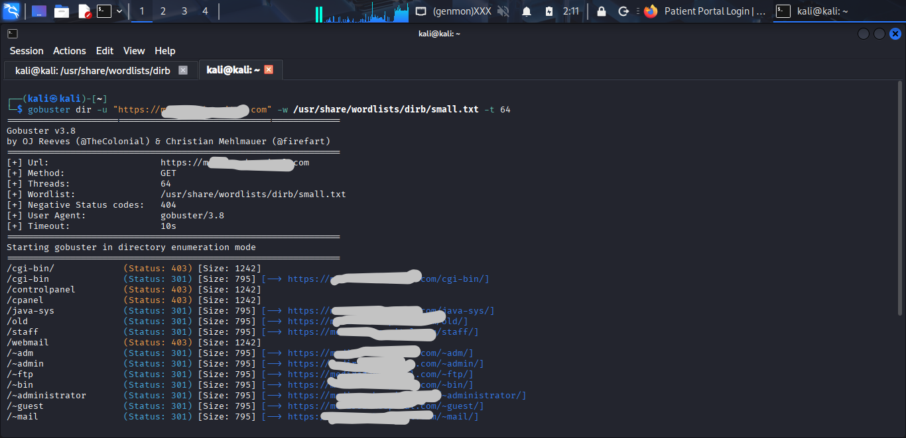
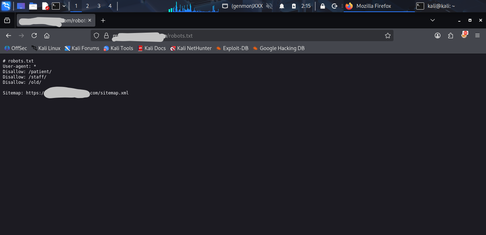
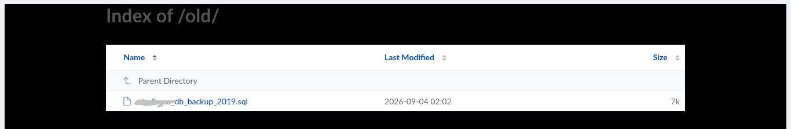
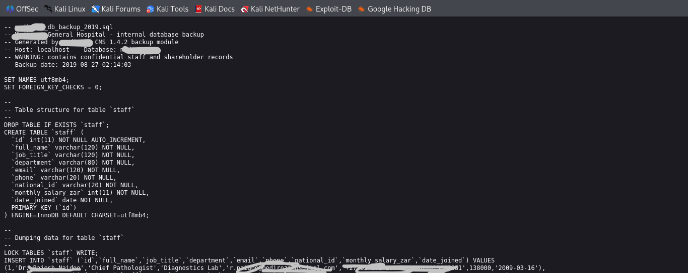

## WEB APPLICATION PENETRATION TESTING REPORT

# [REDACTED] GENERAL HOSPITAL

**Prepared by:** Joseph Victor Ese-Osa
**Instructor:** Waqas Karim, CCIE
**Organisation:** NetworkWalks
**Assessment Type:** Black-Box Web Application Penetration Test
**Client:** [REDACTED] General Hospital
**Target:** `https://(redacted).com`
**Assessment Duration:** 3 Days
**Project:** NetworkWalks Week 4 Captone project, Batch B082
**Classification:** Confidential


# CONFIDENTIALITY NOTICE

This document contains security assessment information intended for authorized personnel only.

The assessment was conducted within a controlled educational environment with written authorization from NetworkWalks. The techniques described in this report must not be applied against systems without explicit permission from the system owner.

Sensitive patient, employee and corporate information discovered during the assessment has been blurred in this report.

---

# 1. EXECUTIVE SUMMARY

## 1.1 Engagement Overview

A black-box web application penetration test was conducted against the authorized General Hospital web environment.

The objective was to assess the security of the web application from an external attacker's perspective, identify weaknesses in the application's exposed attack surface, demonstrate the practical impact of identified vulnerabilities, and document appropriate remediation measures.

The assessment followed the four milestones defined for the engagement:

1. **Initial Access**
2. **Data Extraction**
3. **Critical Data Exposure**
4. **Penetration Testing Report**

The assessment demonstrated multiple security weaknesses affecting authentication, input validation, sensitive information protection and server-side file exposure.

---

## 1.2 Overall Security Assessment

The overall security posture observed during the assessment is considered:

# CRITICAL

The most significant issue identified was a SQL injection vulnerability in the Patient Portal that allowed authentication to be bypassed.

Successful exploitation provided access to a restricted patient area containing three confidential laboratory reports.

Further reconnaissance subsequently identified an exposed legacy directory containing a database backup. Examination of the backup revealed tables containing highly sensitive employee, salary and shareholder information.

The combination of these weaknesses demonstrated that an external attacker could potentially progress from relatively low-level reconnaissance to access of highly sensitive organizational and personal information.

---

## 1.3 Key Findings

| ID   | Finding                                             | Severity |
| ---- | --------------------------------------------------- | -------- |
| F-01 | SQL Injection in Patient Portal                     | Critical |
| F-02 | Authentication Bypass                               | Critical |
| F-03 | Username Enumeration                                | Medium   |
| F-04 | Unauthorized Access to Confidential Patient Reports | Critical |
| F-05 | Weak/Recoverable PDF Password Protection            | Medium   |
| F-06 | Exposed Database Backup                             | Critical |
| F-07 | Sensitive Staff and Salary Information Exposure     | Critical |
| F-08 | Shareholder Information Exposure                    | Critical     |
| F-09 | robots.txt path disclosure     | Low      |

---

# 2. SCOPE AND METHODOLOGY

## 2.1 Scope

| Parameter          | Description                    |
| ------------------ | ------------------------------ |
| Client             | [REDACTED] General Hospital      |
| Target             | `https://(redacted).com` |
| Test Type          | Black-box penetration test     |
| Duration           | 3 days                         |
| Scope              | Target domain only             |
| Social Engineering | Excluded                       |
| Denial of Service  | Excluded                       |

The engagement instructions authorized testing of the target web infrastructure and required the tester to identify vulnerabilities, demonstrate their impact and document the results professionally.

---

## 2.2 Methodology

Testing followed a progressive black-box methodology:

```text
Reconnaissance
      ↓
Attack Surface Enumeration
      ↓
Authentication Testing
      ↓
Input Validation Testing
      ↓
SQL Injection Testing
      ↓
Authentication Bypass
      ↓
Sensitive File Access
      ↓
Password Recovery
      ↓
Further Reconnaissance
      ↓
Legacy Directory Discovery
      ↓
Database Backup File Discovery
      ↓
Sensitive Data Analysis
      ↓
Risk Assessment
      ↓
Remediation Recommendations
```

The approach was adapted throughout the engagement based on observed application behaviour.

---

## 2.3 Tools

The following tools and utilities were used during the assessment:

* NSLookup
* Nmap
* WAFW00F
* Gobuster
* Web browser
* NetworkWalks Password Cracker
* Password wordlists

---

# 3. FINDINGS AND PROOF OF EXPLOITATION

# F-01 — SQL INJECTION

**Severity:** Critical
**Affected Component:** Patient Portal authentication
**Category:** Injection / SQL Injection

## Description

Testing of the Patient Portal authentication functionality identified insufficient handling of user-controlled input.

A single quotation mark (`'`) supplied through the username input caused the application to return a MySQL database error.

This indicated that user-controlled input was being processed in a manner that exposed the underlying database interaction.

Additional database-specific testing was performed to investigate the behaviour.

---

---

## Exploitation

SQL injection testing was performed specifically against the username field.

The vulnerability was subsequently exploited to bypass the application's authentication mechanism.

Successful exploitation resulted in authentication to the Patient Portal.

---

## Impact

Successful SQL injection allowed authentication controls to be bypassed.

This transformed an input-validation weakness into direct unauthorized access to a restricted application area containing confidential patient information.

---

## Risk

**Critical**

The vulnerability affects a security boundary and can allow unauthorized access to sensitive application functionality.

---

## Recommendations

The application should:

* Replace dynamically constructed SQL queries with parameterized queries/prepared statements.
* Validate and constrain user input.
* Ensure database accounts used by the application operate with the minimum required privileges.
* Prevent database errors from being returned to users.
* Perform security testing against all application input points.

---

# F-02 — AUTHENTICATION BYPASS

**Severity:** Critical
**Affected Component:** Patient Portal
**Category:** Authentication / Access Control

## Description

The Patient Portal authentication mechanism could be bypassed through SQL injection in the username field.

Following successful exploitation, the application authenticated the tester and displayed the restricted Patient Portal.

---

## Exploitation Path

```text
Patient Portal
      ↓
Authentication Testing
      ↓
SQL Injection Identified
      ↓
SQL Injection Exploited
      ↓
Authentication Bypassed
      ↓
Patient Portal Access
```

---

## Impact

The authentication bypass allowed access to functionality intended for authenticated users.

The accessible area contained three confidential patient laboratory reports.

This represents a significant confidentiality breach.

---

## Recommendations

The authentication mechanism should be redesigned to:

* Use parameterized database queries.
* Implement server-side authentication checks.
* Use secure session management.
* Enforce authorization on every sensitive resource.
* Prevent authentication decisions from being influenced by untrusted SQL input.
* Implement appropriate monitoring and alerting for repeated authentication failures.

---

# F-03 — USERNAME ENUMERATION

**Severity:** Medium
**Affected Component:** Patient Portal
**Category:** Information Disclosure

## Description

The Patient Portal returned different responses depending on whether the supplied username appeared to exist.

Testing with:

```text
admin:admin
```

returned:

```text
Username not found
```

Testing a different username such as:

```text
John
```

with an arbitrary password returned:

```text
Incorrect password
```

The difference between the responses provided information that could assist an attacker in determining whether a username was valid.

---

## Impact

Username enumeration can reduce the difficulty of subsequent attacks by allowing attackers to identify valid accounts.

In this assessment, the information disclosure occurred alongside a separate SQL injection vulnerability, increasing the overall attack surface.

---

## Recommendations

Authentication failures should return a consistent generic response, such as:

```text
Invalid username or password.
```

The application should additionally implement:

* Use of generic error message
* Rate limiting
* Authentication throttling
* Account lockout controls where appropriate
* Monitoring for repeated authentication attempts


---

# F-04 — CONFIDENTIAL PATIENT REPORT EXPOSURE

**Severity:** Critical
**Affected Component:** Patient Portal
**Category:** Sensitive Data Exposure

## Description

Following successful authentication bypass, three confidential patient laboratory reports were accessed and downloaded.

The reports were encrypted but contained sensitive information including:

* Patient names
* Patient IDs
* Dates of birth
* Referring doctor information
* Laboratory/test results


---

## Impact

Unauthorized access to medical information represents a serious confidentiality risk.

Potential consequences include:

* Patient privacy violations
* Identity-related risks
* Disclosure of medical information
* Reputational damage
* Regulatory/legal consequences depending on the applicable jurisdiction

---

---

## Recommendations

The application should implement:

* Strong passwords on documents
* Server-side authorization
* Role-based access controls
* Secure document storage outside publicly accessible directories
* Access logging and monitoring


---

# F-05 — WEAK/RECOVERABLE PDF PASSWORD PROTECTION

**Severity:** Medium
**Affected Component:** Patient laboratory reports
**Category:** Cryptographic Protection / Password Security

## Description

The three patient reports were protected by PDF encryption.

The NetworkWalks Password Cracker was used to recover the passwords.

The supplied wordlist successfully recovered the passwords for the first two reports.

For the third report, the initial wordlist did not produce a result. An alternative external wordlist was subsequently imported into the same password-cracking tool and successfully recovered the password.

---

## Impact

The ability to recover document passwords through dictionary-based password attacks demonstrates that document-level password protection should not be relied upon as the primary security control for sensitive medical information.

Document encryption should supplement—not replace—strong application-level access control.

---

## Recommendations

* Use strong, randomly generated document encryption passwords where document encryption is required.
* Avoid predictable passwords.
* Use modern encryption mechanisms.
---

# F-06 — EXPOSED DATABASE BACKUP

**Severity:** Critical
**Affected Component:** `/old` directory
**Category:** Sensitive File Exposure

## Description

Further reconnaissance was performed after staff-portal username enumeration proved ineffective.

Directory enumeration and investigation of `robots.txt` identified an `/old` directory.

Inspection of this directory revealed an accessible database backup file.

The backup could be retrieved and examined without requiring the normal application authentication process.

---

## Attack Path

```text
Directory Enumeration
        ↓
robots.txt
        ↓
/old
        ↓
Database Backup
        ↓
Database Analysis
        ↓
Staff Records
        ↓
Shareholder Records
```

---

## Impact

An exposed database backup can provide an attacker with information that would otherwise require direct database compromise.

In this case, analysis revealed structures associated with employee information, salaries and shareholder ownership.

---

## Recommendations

* Remove database backups from the web root.
* Store backups outside publicly accessible directories.
* Apply strict filesystem permissions.
* Regularly scan production environments for exposed backup files.
* Establish a secure backup-retention and deletion policy.

---

# F-07 — SENSITIVE STAFF AND SALARY INFORMATION EXPOSURE

**Severity:** Critical
**Affected Component:** Exposed database backup
**Category:** Sensitive Information Disclosure

## Description

Analysis of the exposed database backup revealed a `staff` table containing highly sensitive employee information.

The identified fields included:

```text
id
full_name
job_title
department
email
phone
national_id
monthly_salary_zar
date_joined
```

The presence of `national_id`, contact information and salary information substantially increases the sensitivity of the exposed data.

---

## Impact

Potential exposure included:

* Employee identities
* Job roles
* Departments
* Contact information
* National identification information
* Monthly salary information
* Employment dates

This information could facilitate identity-related attacks, targeted social engineering, privacy violations and other forms of abuse.

---

## Recommendations

* Remove the database backup from public access.
* Restrict access to employee information using least privilege.
* Encrypt sensitive employee information.
* Apply strict database access controls.
* Review data-retention requirements.
* Avoid storing unnecessary sensitive information.
* Monitor access to employee and payroll information.

---

# F-08 — SHAREHOLDER INFORMATION EXPOSURE

**Severity:** Critical
**Affected Component:** Exposed database backup
**Category:** Confidential Corporate Information Disclosure

## Description

The exposed database backup also contained a `shareholders` table.

The table included:

```text
id
shareholder_name
share_percent
shares_held
share_class
```

This information provides insight into the organization's ownership structure.

---

## Impact

Exposure of shareholder information could disclose confidential corporate ownership information and potentially facilitate targeted attacks, fraud attempts or competitive intelligence gathering.

---

## Recommendations

* Prevent direct access to database backups.
* Restrict shareholder information to authorized personnel.
* Encrypt confidential corporate records.
* Apply least-privilege access controls.
* Monitor access to sensitive corporate information.
* Remove unnecessary legacy files from production servers.

---

# F-09 — DIRECTORY DISCLOSURE THROUGH robots.txt

**Severity:** Critical
**Affected Component:** `robots.txt`
**Category:** Information Disclosure

## Description

Investigation of `robots.txt` revealed application paths including:

```text
/old
/patient
/staff
```

While `robots.txt` is not an access-control mechanism, the disclosed paths provided useful information about the application's directory structure.

The `/old` path subsequently led to the discovery of the exposed database backup.

---

## Impact

The disclosure itself does not grant access to protected resources.

However, it can provide useful reconnaissance information to an attacker and, in this case, contributed to the discovery of a sensitive legacy directory.

---

## Recommendations
* Do not use `robots.txt` to protect sensitive resources.
* Implement actual server-side authorization.
* Remove unnecessary paths from production.
* Review whether sensitive paths need to be disclosed to crawlers.

---

# 4. RISK RATING SUMMARY

| ID   | Finding                    | Severity     | Primary Impact                     |
| ---- | -------------------------- | ------------ | ---------------------------------- |
| F-01 | SQL Injection              | **Critical** | Database/application compromise    |
| F-02 | Authentication Bypass      | **Critical** | Unauthorized access                |
| F-03 | Username Enumeration       | **Medium**   | Account discovery                  |
| F-04 | Patient Report Exposure    | **Critical** | Medical data disclosure            |
| F-05 | Recoverable PDF Protection | **Medium**   | Document confidentiality reduction |
| F-06 | Exposed Database Backup    | **Critical** | Large-scale data exposure          |
| F-07 | Staff/Salary Exposure      | **Critical** | Employee privacy breach            |
| F-08 | Shareholder Exposure       | **High**     | Corporate information disclosure   |
| F-09 | /old directory opened      | **Low**      | Reconnaissance assistance          |

---

# 5. ATTACK CHAIN

The most significant demonstrated attack chain was:

```text
                    EXTERNAL ATTACKER
                           │
                           ▼
                  Target Reconnaissance
                           │
             ┌─────────────┴─────────────┐
             ▼                           ▼
          Nmap                       Gobuster
             │                           │
             └─────────────┬─────────────┘
                           ▼
                    Patient Portal
                           │
                           ▼
                 Username Enumeration
                           │
                           ▼
                    SQL Injection
                           │
                           ▼
                 Authentication Bypass
                           │
                           ▼
                   Patient Portal
                           │
                           ▼
                3 Confidential Reports
                           │
                           ▼
                  Password Recovery
                           │
                           ▼
                   Further Recon
                           │
                           ▼
                     robots.txt
                           │
                           ▼
                         /old
                           │
                           ▼
                Exposed Database Backup
                           │
                 ┌─────────┴─────────┐
                 ▼                   ▼
            Staff Records       Shareholder Records
                 │                   │
                 ▼                   ▼
          Salary / PII        Ownership Information
```

---

# 6. BUSINESS IMPACT

The assessment demonstrated that multiple weaknesses could be chained together to significantly compromise the confidentiality of sensitive information.

## Patient Information

The assessment demonstrated access to reports containing categories of information including:

* Patient identity
* Patient identifier
* Date of birth
* Laboratory results
* Referring physician

## Employee Information

The exposed database contained fields relating to:

* Employee identity
* Job title
* Department
* Email
* Phone
* National identification
* Salary
* Employment date

## Corporate Information

The database also contained:

* Shareholder identity
* Percentage ownership
* Number of shares
* Share class

The combined exposure creates significant privacy, operational and reputational risks.

---

# 7. REMEDIATION PRIORITIES

## Priority 1 — Immediately Remove Public Database Backups

Database backups must be removed from web-accessible directories.

They should be stored in a dedicated, access-controlled backup environment.

---

## Priority 2 — Remediate SQL Injection

All application database queries should be converted to parameterized/prepared statements.

Input validation and secure database access practices should be implemented throughout the application.

---

## Priority 3 — Review Authentication and Authorization

The Patient Portal authentication mechanism should be completely reviewed.

Authentication and authorization must be enforced server-side and must not depend on user-controlled SQL input.

---

## Priority 4 — Protect Patient Records

Patient laboratory reports should only be accessible to authorized users.

Every report request should undergo an authorization check.

---

## Priority 5 — Remove Legacy Resources

The `/old` directory and unnecessary legacy resources should be removed from the production environment.

---

## Priority 6 — Protect Employee and Corporate Information

Access to payroll, employee identity and shareholder information should be restricted according to business need.

Sensitive information should be encrypted where appropriate and monitored for unauthorized access.

---

## Priority 7 — Improve Authentication Error Handling

Replace distinguishable username/password error messages with a consistent authentication failure response.

Implement rate limiting and monitoring.

---

# 8. CONCLUSION

The assessment identified multiple vulnerabilities that, when considered individually and collectively, present a significant security risk to the [REDACTED] General Hospital environment.

The most critical demonstrated issue was SQL injection within the Patient Portal. This weakness enabled authentication bypass and access to confidential patient laboratory reports.

Further reconnaissance demonstrated the importance of continuing the assessment beyond the initial attack path. Investigation of `robots.txt` and the `/old` directory led to the discovery of an exposed database backup containing sensitive staff, salary and shareholder information.

The assessment therefore demonstrated a realistic progression from:

**external reconnaissance → application weakness → authentication bypass → sensitive patient information → further reconnaissance → exposed database backup → organizational data exposure.**

The most urgent remediation actions are to eliminate SQL injection, strengthen authentication and authorization controls, remove publicly accessible database backup and implement appropriate protection for sensitive patient, employee and corporate information.


## Evidences
.png)
.png)
.png)



.png)
.png)
.png)
.png)




.png)
.png)


## Author
## Joseph Victor Ese-Osa


NetworkWalks Cybersecurity Intern Batch B082

LinkedIn: 
https://lnkd.in/p/dvxMybVy


